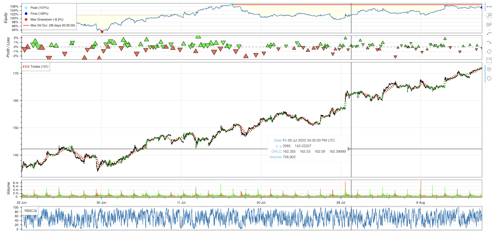

# Wooster Systems

## Reqs

On top of the pip requirements, must have TA-Lib core (kind of a pain) and pretty soon firebase CLI for serving and deploying the interactive result plots.


```bash
wooster processlatest --launch
wooster process 1 --no-results 
```


